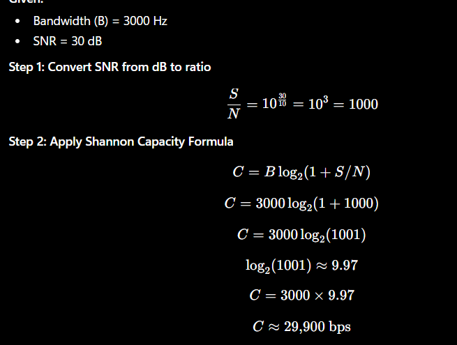

# Network Design Issues and Transmission Concepts

---

## 1. Network Design Issues

Network design issues are the key challenges that must be addressed to ensure reliable, efficient, and secure communication between devices.

### Overview of Issues
1. **Addressing**: Uniquely identifying devices.
2. **Error Control**: Detecting and correcting errors (e.g., Simple Parity Check, 2D Parity Check, CRC, Checksum, Hamming Code).
3. **Flow Control**: Regulating transmission rate (e.g., Stop-and-Wait, Sliding Window).
4. **Congestion Control**: Preventing network overload (e.g., Leaky Bucket, Token Bucket).

---

### A. Addressing
Addressing is the process of uniquely identifying devices and applications in a network so that data reaches the correct destination.

#### Types of Addressing
- **Physical Address (MAC Address)**: Identifies a device within a local network.
- **Logical Address (IP Address)**: Identifies a device across different networks.
- **Port Address**: Identifies a specific application or process (e.g., HTTP on Port 80).
- **Application Address**: Human-readable address (e.g., a URL or email address).

#### Advantages
- Enables unique device identification.
- Enables routing between different networks.
- Supports communication between applications.

---

### B. Error Control
Error control ensures that data is transmitted without corruption by detecting or correcting transmission errors.

#### Simple Parity Check
- Adds one parity bit to the data.
- Can detect single-bit errors but cannot correct them.
- **Advantages**: Simple, low overhead.
- **Disadvantages**: Cannot detect even-numbered bit errors.

#### Two-Dimensional Parity Check
- Uses parity bits for both rows and columns.
- Can detect multiple errors and correct a single-bit error.
- **Advantages**: Better accuracy than simple parity.
- **Disadvantages**: Requires extra parity bits (higher overhead).

#### Cyclic Redundancy Check (CRC)
- Uses polynomial division to generate a CRC code.
- The receiver performs the same calculation to detect errors.
- **Advantages**: Highly accurate, detects burst errors.
- **Disadvantages**: Cannot correct errors.

#### Checksum
- The sender calculates a checksum and sends it with the data.
- The receiver recalculates and compares it.
- **Advantages**: Simple and fast; used in TCP, UDP, and IP.
- **Disadvantages**: Less reliable than CRC.

#### Hamming Code
- Adds multiple parity bits.
- Can detect and correct single-bit errors.
- **Advantages**: High reliability (error detection and correction).
- **Disadvantages**: More complex than parity methods.

#### Error Control Method Comparison

| Method | Detects Errors | Corrects Errors |
| :--- | :--- | :--- |
| **Simple Parity** | Yes | No |
| **2-D Parity** | Yes | Yes (1-bit errors) |
| **Checksum** | Yes | No |
| **CRC** | Yes | No |
| **Hamming Code** | Yes | Yes (1-bit errors) |

---

### C. Flow Control
Flow control regulates the rate of data transmission so that a fast sender does not overwhelm a slow receiver.

#### Stop-and-Wait Protocol
1. The sender sends one frame.
2. The sender waits for an acknowledgment (ACK).
3. The sender sends the next frame only after receiving the ACK.
- **Advantages**: Simple implementation, reliable.
- **Disadvantages**: Low efficiency, high waiting time.

#### Sliding Window Protocol
- The sender can transmit multiple frames before receiving ACKs.
- The window slides forward as acknowledgments arrive.
- **Advantages**: High throughput, better bandwidth utilization.
- **Disadvantages**: More complex, requires larger buffer sizes.

#### Flow Control Comparison

| Feature | Stop-and-Wait | Sliding Window |
| :--- | :--- | :--- |
| **Frames Sent** | One at a time | Multiple |
| **Speed** | Slow | Fast |
| **Efficiency** | Low | High |

---

### D. Congestion Control
Congestion control prevents excessive traffic from overloading the network links and devices.

#### Leaky Bucket Algorithm
- Packets enter a bucket and leave at a fixed, constant rate.
- Extra packets are discarded if the bucket overflows.
- **Advantages**: Smooths out traffic flow, prevents sudden bursts.
- **Disadvantages**: Burst packets may be dropped even if the network is clear.

#### Token Bucket Algorithm
- Tokens are generated at a fixed rate.
- A packet is sent only if a token is available.
- Stored tokens allow bursty transmissions.
- **Advantages**: Supports burst traffic while enforcing a rate limit.
- **Disadvantages**: Slightly more complex to implement.

#### Congestion Control Comparison

| Feature | Leaky Bucket | Token Bucket |
| :--- | :--- | :--- |
| **Output Rate** | Constant | Variable |
| **Burst Traffic** | Not Allowed | Allowed |
| **Packet Loss** | More | Less |

---

## 2. Connection Services

Connection services define how communication is established and managed between two devices.

### Connection-Oriented Service (TCP)
TCP establishes a virtual connection before sending data and guarantees reliable delivery.
- **Features**: Connection setup/teardown, reliable delivery, error recovery, flow/congestion control, ordered delivery.
- **Advantages**: Reliable, no packet loss, ordered.
- **Disadvantages**: Slower, higher overhead.
- **Applications**: HTTP/HTTPS, FTP, Email, SSH, Online Banking.

### Connectionless Service (UDP)
UDP sends data without establishing a connection and does not guarantee delivery.
- **Features**: No connection setup, no acknowledgments, low overhead, fast communication.
- **Advantages**: Faster than TCP, suitable for real-time applications.
- **Disadvantages**: Packet loss possible, no ordering or delivery guarantees.
- **Applications**: Video Streaming, Online Gaming, VoIP, DNS, Live Broadcasting.

### TCP vs UDP

| Feature | TCP | UDP |
| :--- | :--- | :--- |
| **Connection** | Connection-Oriented | Connectionless |
| **Reliability** | Reliable | Unreliable |
| **Acknowledgment** | Yes (ACKs) | No |
| **Packet Ordering** | Guaranteed | Not Guaranteed |
| **Speed** | Slower | Faster |
| **Flow Control** | Yes | No |
| **Congestion Control** | Yes | No |

---

## 3. Transmission Impairments

Transmission impairments are factors that reduce the quality of a signal as it travels through a communication channel, potentially causing data loss or distortion.

### Types of Impairments

#### 1. Attenuation
- **Definition**: Loss of signal strength as it travels over a distance.
- **Causes**: Long transmission distance, cable resistance, signal absorption.
- **Solution**: Use **repeaters** or **amplifiers** to strengthen the signal.

#### 2. Distortion
- **Definition**: The shape or form of the signal changes because different frequency components travel at different speeds.
- **Causes**: Propagation speed differences, imperfect media.
- **Solution**: Use **equalizers** and higher-quality media.

#### 3. Noise
- **Definition**: Any unwanted external signal that interferes with the transmitted signal.
- **Types**:
  - **Thermal Noise**: Random movement of electrons (present in all conductors).
  - **Induced Noise (EMI)**: Caused by nearby motors, generators, or power lines.
  - **Crosstalk**: Interference from an adjacent channel/cable.
  - **Impulse Noise**: Sudden, high-power spikes (lightning, power surges).
- **Solutions**: Shielded cables (e.g., STP), proper grounding, error correction, signal filtering.

---

## 4. Signal Characteristics

### 1. Frequency
- **Definition**: Number of complete cycles (oscillations) of a signal in one second.
- **Unit**: Hertz (Hz)
- **Characteristics**: Higher frequency means faster oscillation.

### 2. Amplitude
- **Definition**: The maximum height or strength of a signal from its zero position.
- **Unit**: Volt (V) (for electrical signals)

### 3. Bandwidth
- **Definition**: The range of frequencies that a communication channel can carry.
- **Unit**: Hertz (Hz)
- **Characteristics**: Higher bandwidth allows more data to be transmitted per second.

### 4. Wavelength
- **Definition**: The distance between two consecutive identical points of a wave (crest-to-crest).
- **Unit**: Meter (m)
- **Relation**: Long wavelength corresponds to lower frequency, and vice versa.

### 5. Bit Rate
- **Definition**: The number of bits transmitted per second.
- **Unit**: bits per second (bps)
- **Characteristics**: Measures actual data transfer speed.

### 6. Baud Rate (Symbol Rate)
- **Definition**: The number of signal changes (symbols) transmitted per second.
- **Unit**: Baud
- **Relation**: One symbol can represent one or more bits. Baud Rate $\le$ Bit Rate.

---

## 5. Formula Example

### Shannon Capacity Formula
The Shannon Capacity formula defines the maximum transmission rate of a channel:

$$C = B \log_2(1 + \text{SNR})$$

Where:
- $C$ = Channel capacity (bps)
- $B$ = Bandwidth (Hz)
- $\text{SNR}$ = Signal-to-Noise Ratio (linear scale)

#### Practice Problem
A communication channel has a bandwidth of 3000 Hz and a Signal-to-Noise Ratio (SNR) of 30 dB. Find the channel capacity using the Shannon Capacity Formula.

